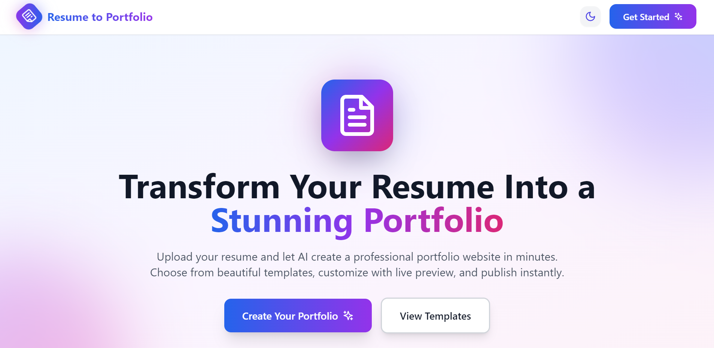
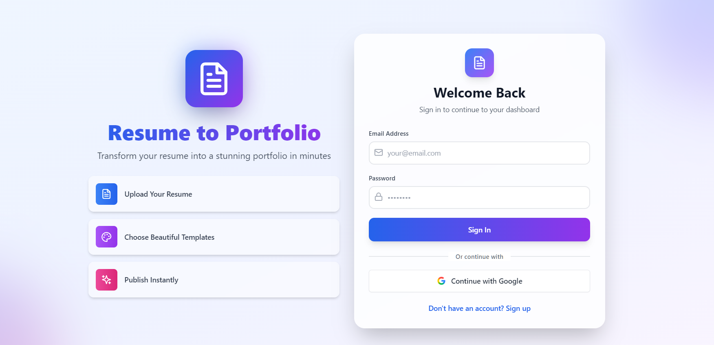
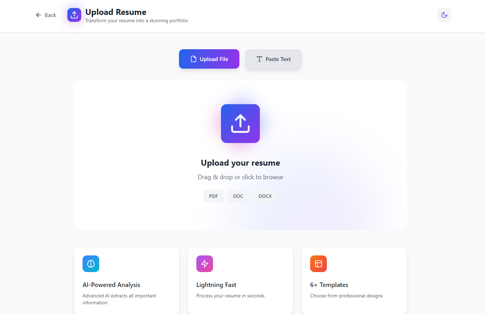
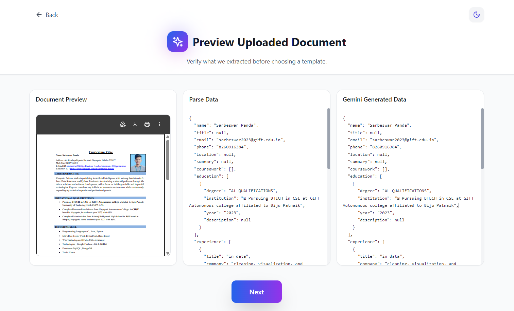
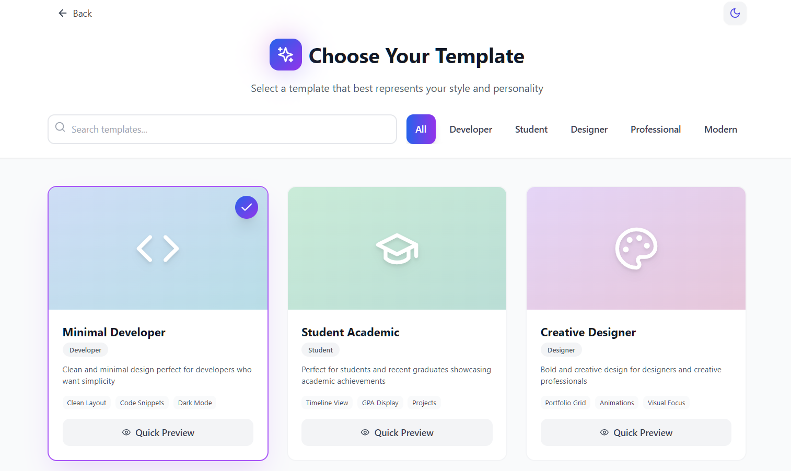
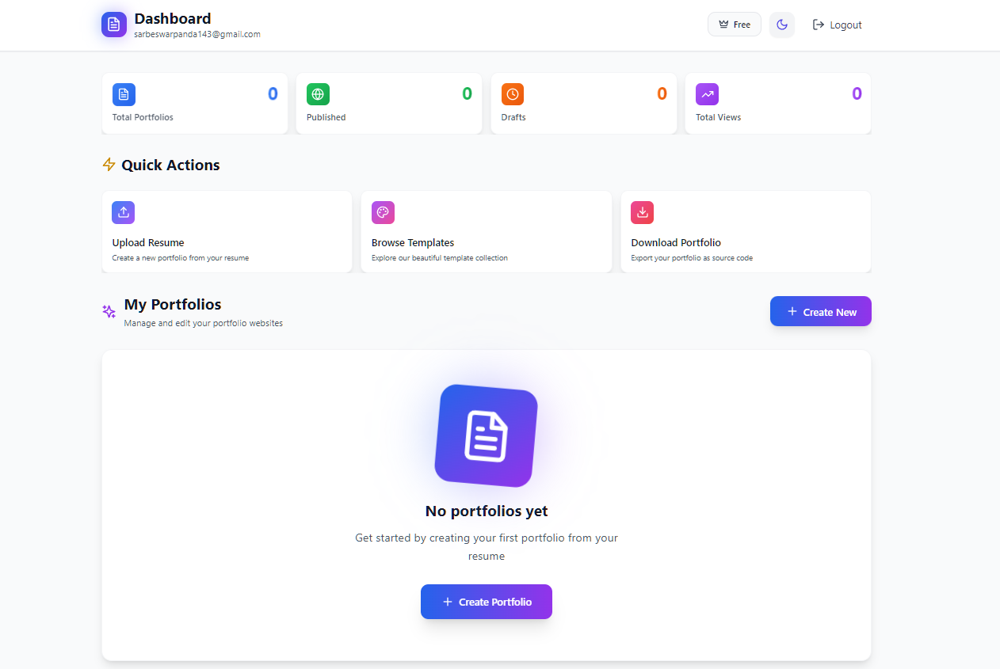
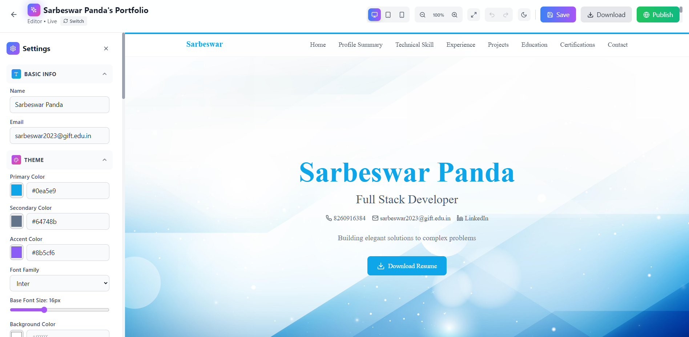

<div align="center">

<!-- Animated title -->


<br/>

<!-- Badges row 1 -->
[](https://reactjs.org/)
[](https://www.typescriptlang.org/)
[](https://fastapi.tiangolo.com/)
[](https://python.org/)

<!-- Badges row 2 -->
[](https://firebase.google.com/)
[](https://tailwindcss.com/)
[](https://vitejs.dev/)
[](https://deepmind.google/technologies/gemini/)

<br/>

[](https://github.com/Sarbeswarpanda04/Resume-to-portfolio/stargazers)
[](https://github.com/Sarbeswarpanda04/Resume-to-portfolio/network/members)
[](https://github.com/Sarbeswarpanda04/Resume-to-portfolio/issues)
[](LICENSE)

<br/>

<p align="center">
  <b>Transform your resume into a stunning portfolio website in minutes using AI-powered parsing and customizable templates — no coding required.</b>
</p>

---

</div>

---

## 📸 Screenshots

<div align="center">

### 🏠 Home Page


<br/>

### 🔐 Authentication


<br/>

### 📤 Upload Resume


<br/>

### 🤖 AI Parse Preview


<br/>

### 🎨 Choose Template


<br/>

### 📊 Dashboard


<br/>

### ✏️ Portfolio Editor


</div>

---

## ✨ How It Works

<div align="center">

```
📄 Upload Resume  ──►  🤖 AI Parses Data  ──►  🎨 Pick a Template  ──►  ✏️ Customize  ──►  🌐 Share Link
```

</div>

1. **Upload** your resume as a PDF or DOCX
2. **AI extracts** your experience, skills, education, projects, and certifications
3. **Choose** from 6 professionally designed templates
4. **Edit** and fine-tune any details in the portfolio editor
5. **Publish** and share your unique public portfolio URL

---

## 🚀 Features

<table>
<tr>
<td width="50%">

### 🤖 AI-Powered
- **Smart Resume Parsing** — Powered by Google Gemini AI
- Extracts work experience, skills, education, projects & certifications automatically
- Handles both PDF and DOCX formats

### 🎨 Templates & Customization
- **6 Premium Templates** — Corporate Professional, Creative Designer, Dark Modern, Minimal Dev, One Page Scroll, Student Academic
- **Dark / Light Mode** — Supported on all templates
- **Portfolio Editor** — Edit every detail before publishing

</td>
<td width="50%">

### 🔐 Auth & Accounts
- Firebase Authentication (email + social login)
- Secure private dashboard per user
- Protected routes

### 🌐 Publishing & Analytics
- Unique **public portfolio URL** for each user
- **Statistics** — Track portfolio views
- **Ratings** — Collect visitor ratings

### 💳 Billing
- Razorpay integration for premium features
- Order creation & payment flow

</td>
</tr>
</table>

---

## 🛠️ Tech Stack

<div align="center">

### Frontend
| Technology | Version | Purpose |
|:---:|:---:|:---|
|  | 18 | UI framework |
|  | 5 | Type safety |
|  | 5 | Build tool |
|  | 3 | Styling |
|  | 10 | Animations |
|  | 3 | Advanced animations |
|  | 10 | Auth & DB |
|  | 6 | Routing |

### Backend
| Technology | Version | Purpose |
|:---:|:---:|:---|
|  | 3.10+ | Runtime |
|  | 0.109+ | REST API |
|  | 6.4+ | Server-side DB |
|  | 0.8+ | AI parsing |
|  | 1.4+ | Payments |

</div>

---

## 📁 Project Structure

```
Resume-to-portfolio/
├── 📂 backend/
│   ├── 🐍 main.py                  # FastAPI app entry point
│   ├── 📋 requirements.txt
│   ├── 🔑 firebase-credentials.json
│   └── 📂 app/
│       ├── 📂 api/                 # Route handlers (auth, resume, portfolio, billing)
│       ├── 📂 core/                # Config, database, security
│       ├── 📂 models/              # Pydantic schemas
│       ├── 📂 routers/             # Statistics & ratings routes
│       └── 📂 services/            # AI parser, Firebase DB, resume parser
├── 📂 frontend/
│   ├── 📂 src/
│   │   ├── 📂 pages/               # HomePage, Dashboard, UploadResume, etc.
│   │   ├── 📂 components/          # Shared components
│   │   ├── 📂 templates/           # 6 portfolio templates
│   │   ├── 📂 services/            # API clients
│   │   ├── 📂 context/             # Auth context
│   │   └── 📂 utils/               # Data transformers
│   └── 📦 package.json
├── 🖥️ setup.bat                    # Windows setup script
├── 🐧 setup.sh                     # Linux/macOS setup script
└── 📄 README.md
```

---

## ⚙️ Prerequisites

Before you begin, ensure you have:

-  installed
-  installed
- A **Firebase** project with Firestore and Authentication enabled
- A **Google Gemini API** key ([get one here](https://aistudio.google.com/app/apikey))
- A **Razorpay** account *(optional, for billing)*

---

## 🏁 Getting Started

### 1. Clone the repository

```bash
git clone https://github.com/Sarbeswarpanda04/Resume-to-portfolio.git
cd Resume-to-portfolio
```

### 2. Run the automated setup script

<table>
<tr>
<td>

**Windows**
```bat
setup.bat
```

</td>
<td>

**Linux / macOS**
```bash
chmod +x setup.sh
./setup.sh
```

</td>
</tr>
</table>

> The setup script installs all dependencies for both frontend and backend automatically.

### 3. Configure environment variables

Create a `.env` file in the `backend/` directory:

```env
SECRET_KEY=your_secret_key_here
GOOGLE_API_KEY=your_gemini_api_key_here
RAZORPAY_KEY_ID=your_razorpay_key_id
RAZORPAY_KEY_SECRET=your_razorpay_key_secret
```

### 4. Add Firebase credentials

Copy `backend/firebase-credentials.example.json` → `backend/firebase-credentials.json` and fill in your Firebase service account details.

Configure Firebase for the frontend in `frontend/src/config/firebase.ts`:

```ts
const firebaseConfig = {
  apiKey: "YOUR_API_KEY",
  authDomain: "YOUR_AUTH_DOMAIN",
  projectId: "YOUR_PROJECT_ID",
  storageBucket: "YOUR_STORAGE_BUCKET",
  messagingSenderId: "YOUR_MESSAGING_SENDER_ID",
  appId: "YOUR_APP_ID"
};
```

---

## ▶️ Running the Application

### Backend

```bash
cd backend
pip install -r requirements.txt
uvicorn main:app --reload --port 8000
```

| | URL |
|---|---|
| API Base | `http://localhost:8000` |
| Interactive Docs (Swagger) | `http://localhost:8000/docs` |
| ReDoc | `http://localhost:8000/redoc` |

### Frontend

```bash
cd frontend
npm install
npm run dev
```

App will be available at **`http://localhost:5173`**

---

## 📡 API Endpoints

<details>
<summary><b>Click to expand API reference</b></summary>

| Method | Endpoint | Description |
|:---:|:---|:---|
| `POST` | `/api/auth/register` | Register a new user |
| `POST` | `/api/auth/login` | Login |
| `POST` | `/api/resume/upload` | Upload and parse resume |
| `GET` | `/api/portfolio/{id}` | Get portfolio by ID |
| `PUT` | `/api/portfolio/{id}` | Update portfolio |
| `GET` | `/api/portfolio/public/{slug}` | Public portfolio view |
| `POST` | `/api/billing/order` | Create payment order |
| `GET` | `/api/statistics` | Get platform statistics |
| `POST` | `/api/ratings` | Submit a rating |

</details>

---

## 🎨 Portfolio Templates

<div align="center">

| Template | Best For | Style |
|:---|:---|:---|
| 🏢 **Corporate Professional** | Business, finance, management | Clean, formal |
| 🎨 **Creative Designer** | UI/UX, graphic design, creative fields | Colorful, bold |
| 🌑 **Dark Modern** | Software engineers, developers | Dark, sleek |
| ⚡ **Minimal Dev** | Tech professionals | Minimal, fast |
| 📜 **One Page Scroll** | All roles | Smooth scroll |
| 🎓 **Student Academic** | Students & recent graduates | Light, academic |

</div>

---

## 🤝 Contributing

Contributions are welcome! Here's how to get started:

```bash
# 1. Fork the repository on GitHub

# 2. Create your feature branch
git checkout -b feature/amazing-feature

# 3. Commit your changes
git commit -m "feat: add amazing feature"

# 4. Push to your branch
git push origin feature/amazing-feature

# 5. Open a Pull Request
```

---

## 📄 License

This project is licensed under the terms found in the [LICENSE](LICENSE) file.

---

<div align="center">

**Made with ❤️ by [Sarbeswarpanda04](https://github.com/Sarbeswarpanda04)**

[](https://github.com/Sarbeswarpanda04/Resume-to-portfolio)


</div>
